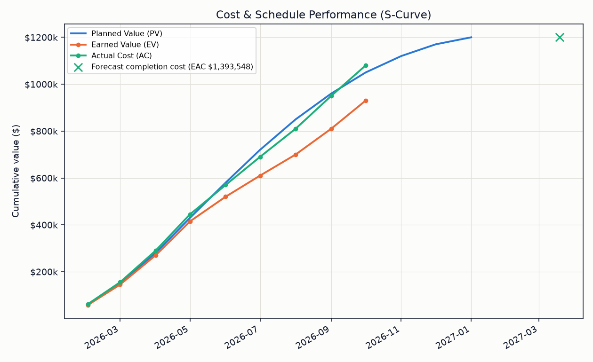
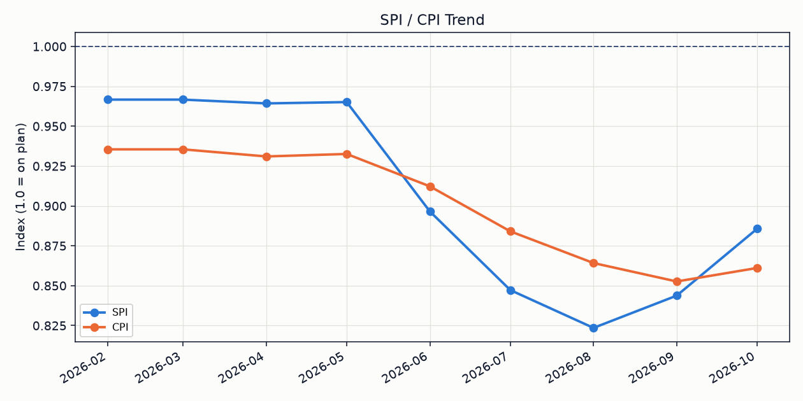
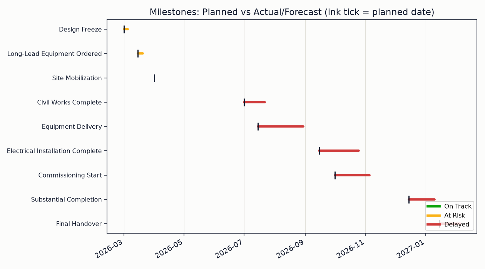
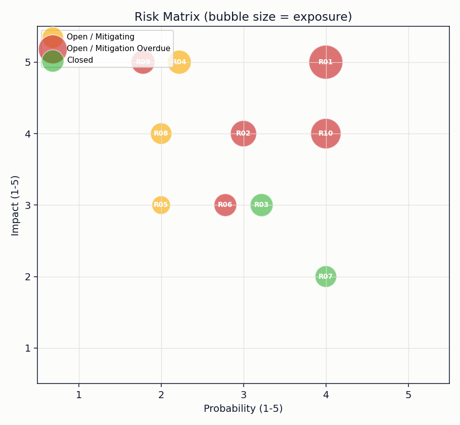
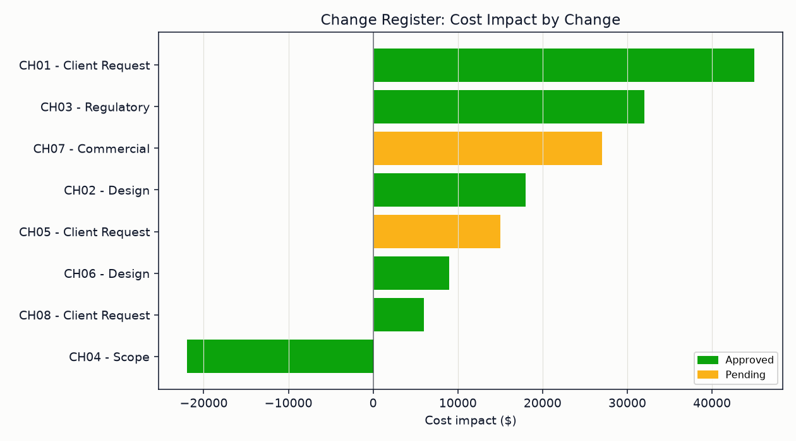

# Project Controls Dashboard

Operationalizes the standard project controls status cycle, earned value
performance, schedule slippage, risk exposure, and change impact, as software
instead of a spreadsheet rebuilt every reporting period. Feed it a
cost/schedule timeseries, a milestone log, a risk register, and a change
register, and it produces the same status report and charts a project
controls function would hand to a steering committee.

Part of a small project-controls toolkit: **project-controls-dashboard** (this repo),
[schedule-health-analyzer](https://github.com/alexc-hue/schedule-health-analyzer),
[change-control-register](https://github.com/alexc-hue/change-control-register),
[risk-trend-tracker](https://github.com/alexc-hue/risk-trend-tracker).



## Problem

On most projects, "are we on track?" gets answered from a gut feeling or a stale
Gantt chart, because pulling together EVM metrics (SPI, CPI, EAC), milestone
slippage, and a ranked risk view usually means a manual spreadsheet exercise
redone every reporting cycle. This project automates that exercise: point it at
three CSVs and it produces the same status report a project controls function
would hand to a steering committee.

## Approach

- Model the project as four inputs a controls function already tracks: a
  cumulative PV/EV/AC timeseries, a milestone log (planned vs. actual/forecast
  dates), a risk register (probability × impact, mitigation owners and due
  dates), and a change register (cost/schedule impact, approval status).
- Compute standard EVM metrics (SV, CV, SPI, CPI, EAC, ETC, VAC, TCPI) as of the
  latest reporting period, plus an SPI-adjusted forecast completion date. The
  formulas follow the earned value management practice standardized in
  ANSI/EIA-748, not a custom scoring scheme.
- Classify each milestone as On Track / At Risk / Delayed from its slip in days,
  and flag risks whose mitigation is overdue.
- Sum approved changes into a revised budget (BAC plus approved cost impact),
  reported separately from CPI/EAC rather than folded into them, so
  performance variance (how the work is going) stays distinguishable from
  scope-change variance (how much the baseline itself moved).
- Render five charts (S-curve, SPI/CPI trend, milestone timeline, risk matrix,
  change register) and print a console status report in the same shape a
  weekly report would use.

The sample data is a fictional 12-month infrastructure project (substation
upgrade) that starts on plan and slips from month five onward — chosen
deliberately so the dashboard has something to actually flag, rather than a
project with nothing to report.

## Implementation

Built in Python so the methodology runs as reproducible code rather than a
spreadsheet that drifts from version to version: pandas for the EVM/date
calculations, matplotlib for the charts. No external services or APIs,
everything runs from local CSVs.

## Result

```
============================================================
PROJECT STATUS REPORT — as of 2026-10
============================================================
Percent complete (earned):  77.5%

Planned Value (PV):         $1,050,000
Earned Value (EV):          $930,000
Actual Cost (AC):           $1,080,000

Schedule Variance (SV):     $-120,000  (-11.4%)
Cost Variance (CV):         $-150,000  (-16.1%)
SPI (schedule performance): 0.89
CPI (cost performance):     0.86

Estimate at Completion (EAC):  $1,393,548
Estimate to Complete (ETC):    $313,548
Variance at Completion (VAC):  $-193,548  (over budget)
To-Complete Perf. Index (TCPI): 2.25

Forecast completion (SPI-adjusted): 2027-03-19 (planned: 2027-01-31)
```

Plus a milestone list with slip-in-days, and the top risks ranked by exposure
with overdue mitigations flagged.

A saved copy of this report is generated alongside the charts: see
[assets/report.md](assets/report.md).

## Screenshots

**Cost & schedule performance (S-curve)** — planned vs. earned vs. actual, with
the cost-performance-adjusted forecast at completion.


**SPI/CPI trend** — cost and schedule performance index by reporting period.



**Milestones** — planned date (black tick) vs. actual/forecast, colored by
status.



**Risk matrix** — probability × impact, bubble size = exposure.



**Change register** — cost impact by change, approved vs. pending.



## What I learned

Framing this as "what would I actually hand to a steering committee" rather
than "what's a cool chart to build" is what kept the scope in check — four
charts and one status report cover the questions a sponsor actually asks
(are we late, are we over budget, what's driving it, what's still open), and
anything past that would have been decoration rather than signal. The other
useful constraint was picking sample data that tells a story: a project that's
perfectly on plan doesn't exercise the variance/forecast/risk-ranking logic at
all, so the dashboard is only as convincing as the scenario behind it.

## Run it

```bash
pip install -r requirements.txt
python dashboard.py
```

Swap in your own `data/cost_schedule_timeseries.csv`, `data/milestones.csv`,
`data/risk_register.csv`, and `data/change_register.csv` (same columns) to
point it at a real project.
